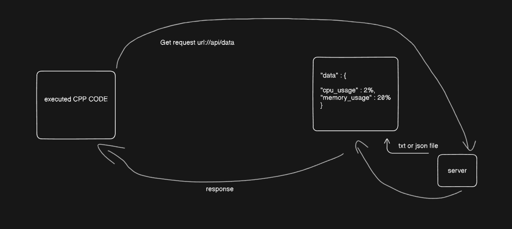
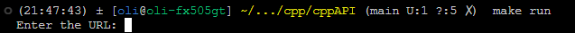
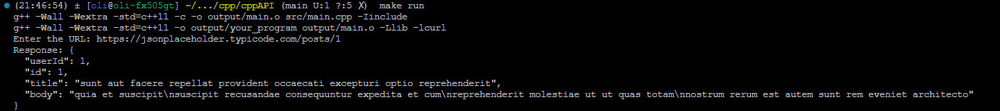

# Making calls with cpp

to run the script please make sure you have installed libcurl

```
sudo apt-get install libcurl4-openssl-dev
```
```
git clone https://github.com/olssonik/cppAPI
```
```
cd cppAPI
```
```
make run
```





